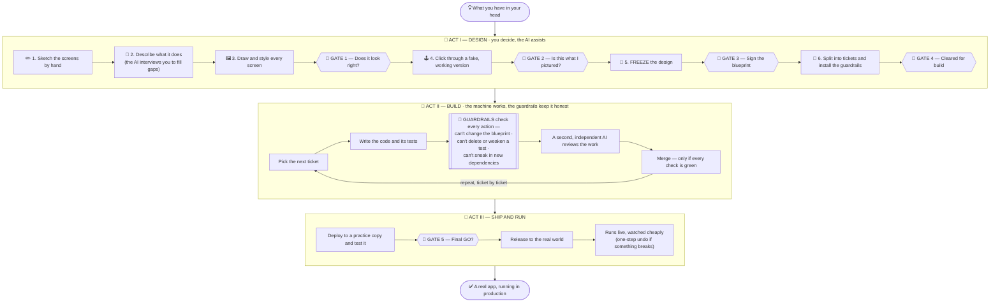

# VECTOR

**Visual Engineering and Coding Technique for Outcome-driven Releases**

A structured method for taking what you have in your head to an application running in production — directly, efficiently, unequivocally, robustly. Humans design; the machine builds; deterministic gates keep both honest.

---

## What it is

VECTOR 2.0 is a 19-step process organized in three acts:

- **Act I — Design** (Steps 1–15, human directs, AI assists): sketches → PRD + structured clarify → wireframes → views → API–frontend reference → ERD → OpenAPI → model specs → **interactive mock** (you use the fake app before freezing the real one) → roadmap → **design freeze** (CONTEXT + POLICY, the contract) → issues + machine ledger → handover + enforcement layer → GitHub bootstrap + branch protection → preflight + launch authorization
- **Act II — Build** (Steps 16–17, machine): the autonomous build loop and the autonomous phase close, repeated per phase MVP → V1 → V2
- **Act III — Production** (Steps 18–19, shared): release via `/promote` (staging → smoke → human GO → prod → rehearsed rollback) and operate & evolve — the frozen spec governs the application in production, forever

Five human gates: views ◆ mock ◆ freeze ◆ launch ◆ GO. Everything else is either a derivation from the frozen spec or an escalation.

The core rule is unchanged from v1, now enforced instead of trusted: **the spec is not an input to a supervised agent — it is a contract.** Hooks, CODEOWNERS and CI make violating it mechanically impossible; when the spec is ambiguous, the machine escalates. It never guesses.

---

## How it works — a plain-language walkthrough

*New here, and not a programmer? Start with this. It explains the whole idea with no jargon.*

### The one-sentence version

You take an idea for an app, decide exactly what it should look like and do, then hand the **building** to an AI that works on its own — while automatic **guardrails** make it impossible for that AI to cut corners, cheat on tests, or quietly change your plan.

### Three roles, and who does what

Think of a small construction project with three characters:

- **🧑 You — the architect.** You decide *what* gets built: the screens, the rules, what "done" means. This is the part no automation replaces, and VECTOR front-loads it.
- **🤖 The machine — the builder.** Once the design is locked, an AI does the actual construction — writing the code and its tests, one ticket at a time, on its own.
- **🚧 The gates — the building inspector who never sleeps.** Automatic checks that sit between the builder and the finished wall. The builder physically cannot get past them if it tries to change the sealed blueprint, remove a safety test, or use materials nobody approved. No trust required — it's mechanical.

The magic isn't that the AI is brilliant. It's that **the AI is boxed in by rules it cannot break**, so you can let it work unattended and still trust the result.

### The journey, as a picture



The **👤 diamonds are the only five moments that need you** once building starts. Everything else the machine handles — or, if it hits something genuinely unclear, it *stops and asks* rather than guessing.

### Step by step, in order

**Act I — Design (you lead; this is where your judgment lives).**

1. **Sketch.** Draw the screens on paper and photograph them. Rough is fine — it's raw material to react to.
2. **Describe + interview.** You write down what the app is for and who uses it; the AI asks pointed questions to expose anything vague. Unanswered questions are left as visible flags, never quietly guessed.
3. **Design the screens.** Each screen is drawn at full fidelity and styled, and shown in a real browser so you can approve exactly what you see. **← 👤 Gate 1.**
4. **Try a fake version.** The AI generates a *clickable prototype* — a working-looking fake app wired to pretend data — so you can walk through it as if it were real. Anything that feels wrong gets fixed in the plan now, when fixing it costs minutes. **← 👤 Gate 2.**
5. **Freeze.** You seal the design. From this moment the plan is a **contract**: it can only change through one deliberate, tracked procedure — never on a whim, never silently. **← 👤 Gate 3.**
6. **Prepare the build.** The AI turns the plan into a list of small tickets (each with a precise "done" test) and installs the guardrails into the project as files. You give the final go-ahead to start building. **← 👤 Gate 4.**

**Act II — Build (the machine leads).**

7. The builder AI takes one ticket, writes the code and the tests for it, and opens it for review.
8. **The guardrails run on every keystroke and every merge.** They refuse any attempt to edit the frozen blueprint, delete or hollow out a test, or add an unapproved dependency.
9. A **second, independent** AI reviews the work with fresh eyes (it never sees the first AI's reasoning, so it doesn't inherit its blind spots).
10. The work merges **only if every automatic check passes.** Then the builder picks up the next ticket. *(Fully unattended, look-away merging is the L2/L3 "autonomy dial" setting — it's built and control-flow-proven but not yet run live end to end, so today you start at L0/L1 and review + merge each ticket yourself; the guardrails hold either way.)*

**Act III — Ship and run (shared).**

11. The finished version is deployed to a **practice copy** ("staging") and tested there first.
12. **You give the final GO** — the single human sign-off before real users see it. **← 👤 Gate 5.**
13. It goes live, is monitored with cheap automatic rules (not an expensive AI watching 24/7), and can be **rolled back in one step** if anything misbehaves.

### The two-layer install, explained simply

There are two separate things, and keeping them straight is the whole trick:

- **The method** installs once on your computer, as a plugin. Think of it as **a set of power tools** — it gives you the commands (`/vector:new-project`, `/vector:run-phase`, …).
- **The contract** is created fresh **inside each project**, as real files that live in that project's folder. Think of it as **the building code stapled to that specific job site.**

Why separate them? Because a rule that lives in *your* toolbox can't protect a *project*. The guardrails have to be committed files inside the project itself, so that anyone who opens that project — even without VECTOR installed — is still protected by them. **The plugin gives you the verbs; the project holds the contract.**

### How much you let it drive — the autonomy dial

You choose how much freedom the machine gets, like levels of cruise control, and you **earn** your way up as it proves itself:

- **L0 / L1** — you review and approve every change (the machine's reviewer runs quietly alongside, building a track record).
- **L2** — the machine merges on its own, and you get a ~20-minute daily digest with a one-click undo.
- **L3** — full autonomy; you only hear about decisions and finished phases.

The dial is **only ever turned up by you**, never by the machine.

### Why you can trust it

Two promises do the heavy lifting. First, **it never guesses:** when the plan is unclear, the machine stops and asks you rather than inventing an answer — so ambiguity surfaces as a question, not as a silent wrong turn. Second, **the rules are mechanical, not polite requests:** the guardrails are enforced by the tools themselves, so "please don't change the blueprint" becomes "you *can't* change the blueprint." And whatever you build, you keep — every project is an ordinary, standard codebase that any team can take over later, with or without VECTOR.

---

## The autonomy dial

Set per project in `POLICY.md`; raised only by the human, never by the loop.

| Level | Behavior |
|---|---|
| L0 | Classic v1: human reviews and merges every PR |
| L1 | Human merges; gates live; reviewer runs in shadow (divergence vs. you = trust telemetry) |
| L2 | Autonomous merges + mandatory daily digest with revert authority + one `/how-to-navigate` per phase |
| L3 | Full autonomy: escalations and phase reports only |

---

## What makes v2 different

- **Enforcement as files, not instructions:** PreToolUse hooks (red-teamed, 47-case battery), CODEOWNERS on frozen paths, CI checks (conformance, security, coverage-ratchet, test-protection), and branch protection that requires a dedicated machine user (the piece an operator sets up; the pilot ran single-identity).
- **The interactive mock (Step 9):** a clickable prototype generated from your specs, used before the freeze — the intent check moved to where corrections cost minutes.
- **Escalation as the only ambiguity resolution:** six classes, park-and-continue scheduling, circuit breakers, kill-safe state.
- **Rollback as mechanism:** an annotated tag per autonomous merge; `vector-revert` opens a revert PR through the same gates.
- **Production on the ops cost ladder:** deterministic rules → optional guardrailed local LLM → Claude only when the human invokes it. No resident agents burning tokens watching deploys.
- **Exit guarantee:** every project is a standard repository any team can take over without VECTOR existing.

---

## Stack & profiles

The **`webapp`** profile (complete in 2.0.0) targets the reference stack: Python + FastAPI · React + Tailwind · PostgreSQL · Docker. The **`service-api`** profile is defined as a strict subset (no views/mock; API-level exploration). `cli/library` and `quant-pipeline` arrive in 2.x. Deploy profiles: `vps-compose` (reference) and `aws`.

---

## Requirements

- Claude Code (subscription or API)
- Python 3.11+ (the hooks and the Tier-2 runner), Node.js, Playwright (the Explorer)
- A GitHub account **plus a dedicated machine user** for autonomous merges

Claude.ai is no longer required: v2's canonical surface is Claude Code end to end. Chat surfaces remain a fine place to think — nothing is real until it is a committed file.

---

## Installation — two layers

### 1. The method on your machine (once)

```
/plugin marketplace add fedeglan/vector
/plugin install vector
```

Installs the namespaced commands (`/vector:new-project`, `/vector:run-phase`, …) and agents globally, versioned as a unit. Manual fallback: clone + `make install`.

> **What works today (2.0.0):** Act I end to end; Tier 3 (the gates — hooks, CI, protection); Act III (`/promote` + the ops-pack) exercised on a real local deploy target; and **the Tier-2 relay-runner is built** (`src/orchestration/runner/`, `vector-run`/`vector-revert`), with its control flow executed **39/39** against the real runner (incl. a real kill/resume) plus a red-team pass. What it has **not** yet done is close the loop with live `claude -p` *builder* processes — that needs an authenticated headless CLI and a dedicated machine user (operator setup). So in practice you operate Act II at **L0/L1** today (you review and merge each PR; the gates enforce the contract underneath), and turn on autonomous merging (L2/L3) once you've set those up and earned the trust telemetry. See *Method status* and `src/orchestration/runner/README.md`.

### 2. The contract in each repo

```
/vector:new-project /path/to/projects/my-app
```

The plugin gives you the verbs; each project gets the contract and gates as files in its own repository — hooks, CODEOWNERS, workflows, `POLICY.md`. **The plugin installs the method; the repo instantiates the contract.**

---

## Usage

```
/vector:new-project …      # scaffold
# Steps 1–15: design, mock, freeze, preflight — you direct
/vector:run-phase           # Act II: the machine builds; escalations reach you
/vector:promote             # Act III: staging → smoke → your GO → production
/vector:change-scope        # the only way specs change after the freeze
```

---

## Repository structure

```
vector/
├── .claude-plugin/
│   ├── plugin.json             ← the plugin manifest (this is what /plugin install reads)
│   └── marketplace.json        ← the repo doubles as its own marketplace
├── agents/                     ← vector-builder · vector-reviewer (model-pinned, isolated context)
│                                 auto-discovered by Claude Code from this top-level dir (see note)
├── src/
│   ├── commands/               ← the method's verbs (28 .md files)
│   ├── templates/
│   │   ├── POLICY_TEMPLATE.md  ← the per-project autonomy contract
│   │   ├── CODEOWNERS          ← frozen-path protection template (webapp reference)
│   │   └── workflows/          ← the 5 CI required-check templates (webapp reference; /handover adapts)
│   └── orchestration/
│       ├── SPEC.md             ← the three-tier Act II spec
│       ├── hooks/              ← the Tier-3 gate hooks (edit-time) + their red-team batteries
│       │   ├── frozen_specs.py · test_protection.py · deps_guard.py
│       │   ├── hooks.json      ← the settings wiring copied into each project
│       │   └── tests/          ← redteam.py · redteam2.py · redteam3.py (47 red-team cases + hardening regressions)
│       ├── ci/                 ← the merge-time logic nets (real code, not YAML)
│       │   ├── coverage_ratchet.py · test_protection_ci.py
│       │   └── tests/redteam_ci.py  ← executed battery (18/18)
│       └── runner/             ← the Tier-2 relay-runner (built)
│           ├── vector_runner/  ← the package (vector-run / vector-revert); cli, state,
│           │                     policy, scheduler, pipeline, spawn, gates, digest, revert
│           ├── README.md       ← build contract + live-run runbook
│           └── tests/          ← fsm_sim.py (spec, 8/8) · test_fsm_live.py (real runner, 39/39)
├── docs/
│   ├── VECTOR.md               ← the full v2 method (19 steps)
│   ├── OPERATIONS.md           ← the Step-19 ops spec (cost ladder, migrations, solo-ops)
│   └── DECISIONS.md            ← decisions, council audits, validation, rollout
├── CHANGELOG.md                ← method versioning (semver)
├── Makefile                    ← install fallback + `make test` (runs the gate batteries)
├── README.md
└── LICENSE
```

> **Plugin component discovery (maintainer note).** `commands` is a directory path declared in `plugin.json`; **agents are auto-discovered from the top-level `agents/` directory** and are deliberately *not* listed in `plugin.json`. Current Claude Code CLIs do **not** honor an enumerated `agents` array in the manifest — it passes `plugin validate` but silently registers zero agents. Add an agent by dropping its `.md` file in `agents/`, never by editing `plugin.json`. Verify with `claude plugin details vector@vector` (the Agents count must match the file count).

---

## Commands

| Command | What it does |
|---|---|
| **Setup** | |
| `/setup` | Install the runner + Playwright, authenticate GitHub, guide the machine-user token, and prove the gates hold on this machine |
| `/new-project` | Scaffold a project: structure, hooks wired, GitHub repo. Instantiates the contract side |
| `/resume` | Detect where a project stands (runner state is authoritative in Act II) and continue |
| **Act I — Design** | |
| `/design` | The Act I driver: sketches → PRD → wireframes → views ◆ → reference → ERD → OpenAPI → model specs → roadmap |
| `/clarify` | Structured coverage interrogation of the PRD; `[NEEDS CLARIFICATION]` markers |
| `/mock` | Generate the Step-9 interactive prototype from the frozen-track artifacts ◆ |
| `/freeze-design` | CONTEXT + POLICY + baselines + tag — the contract ◆ |
| `/generate-issues` | Step 12: derive the backlog — `GITHUB_ISSUES.md` + `.vector/issues.json` (executable `verification:` blocks, DAG) |
| `/handover` | Step 13: classic handover + the merge-time enforcement layer as files (CI, CODEOWNERS, CI scripts) + ops-pack |
| `/bootstrap-github` | Step 14: board + labels (incl. needs-human/escalated) + DEV branch protection with the six required checks + machine-user verification + ledger asserts |
| `/preflight-audit` | Ambiguity scan · coverage matrix · env dry-run · hooks red-team + revert rehearsal ◆ |
| **Act II — Build** | |
| `/run-phase` | The dispatcher: launch and monitor the autonomous loop for a phase |
| `/ship-issue` | The per-issue pipeline: branch → implement → review → gates → merge → tag |
| `/solve-issue` | Implement a specific issue with debugging guidance |
| `/review-pr` | Review a PR against the specs; sets the `reviewer-approval` status check |
| `/explain-pr` | Explain a PR in very simple terms |
| `/audit-plan` | Audit the codebase against the plan and specs (drift check + phase gate) |
| `/test-plan` | Complete and run the suite; classify every failure (code-bug / test-bug / flaky / spec-conflict) |
| `/explore` | The Playwright Explorer: network-asserted walkthroughs + visual regression |
| `/debug` | Analyze and fix broken things |
| `/fix-bugs` | Work the backlog by severity; every fix ships a regression test through the full gates |
| `/escalate` | File a decision request; park-and-continue. The only sanctioned answer to ambiguity |
| `/change-scope` | The only way a frozen spec changes — with impact analysis and human approval |
| **Act III — Production** | |
| `/promote` | Staging → Explorer smoke → human GO ◆ → prod → verify → rollback |
| `/triage` | The morning ops session over the sanitized digest |
| **Human tools** | |
| `/how-to-navigate` | Prepare the human for exploratory testing (required once per phase at L2) |
| `/report-bug` | Capture a bug during exploratory testing |
| `/upgrade-project` | Retrofit a VECTOR v1 repo to the v2 contract |

◆ = a human gate.

---

## Method status

**v2.0.0 — definition frozen 2026-07-15.** Validated by execution, not assertion: hooks red-team 47/47 (one real bypass found and fixed) + CI nets 18/18; the Tier-2 runner's control flow **39/39 against the real runner** via deterministic shims (incl. a real SIGKILL/resume) with a 16-agent red-team that found and fixed 9 issues (`fsm_sim.py` still 8/8); Act I + L0/L1 Act II proven end-to-end on a real pilot; `/promote` + Act III (E/F machinery) exercised on a real *local* deploy target. The honest residuals — documented, not hidden — are a live `claude -p` builder run (needs headless auth + a machine user), a real *remote* deploy target, and multi-project operating data over time; see `docs/DECISIONS.md` §6–§7. The published 15-step method is anchored at the `v1-final` git tag. Changes to the method itself now go through its own change-scope discipline.

---

## License

MIT

## Citation
Glancszpigel, Federico M., VECTOR: A Structured Method for AI-Assisted Fullstack Software Development (April 03, 2026). Available at SSRN: https://ssrn.com/abstract=6516343
