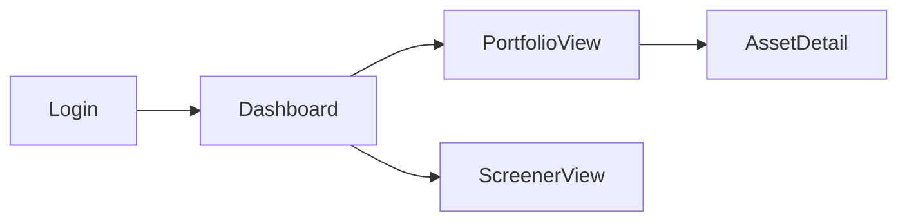

# The VECTOR
> A reusable, end-to-end method for designing and building any fullstack app.
> Python · React · PostgreSQL · Claude · Claude Code

---

## Core Principle

The human thinks visually. Everything else derives from what the human can see and touch.

**Design of outside → in. From uncertain to stable.**

---

## Roles

| Actor | Role |
|---|---|
| **You** | Think, draw, decide, validate, approve |
| **Claude.ai** | Ask, structure, generate, derive, plan |
| **Claude Code** | Build, audit, ship |

> Never mix roles in the same session.

---

## The 15 Steps

```
HIGH HUMAN INVOLVEMENT
  Step 1  · Basic Idea Visualization          (BIV)
  Step 2  · Assisted Product Requirements     (APRW)
  Step 3  · AI Frontend Sketching Proposal    (AFSP)
  Step 4  · Frontend Skeleton De-codification (FSD)

AI DOES THE WORK · HUMAN REVIEWS
  Step 5  · API Contract Generation           (ACG)
  Step 6  · Data Model Generation             (DMG)
  Step 7  · Quant Model Dev Specifications    (QMDS)  [if applicable]
  Step 8  · Architecture Design Documentation (ADD)
  Step 9  · Development Plan                  (DP)
  Step 10 · Context Generation & Design Freeze(CGDF)

HANDOVER
  Step 11 · GitHub-ification                  (GHI)
  Step 12 · Handover Preparation              (HP)

CLAUDE CODE TAKES OVER
  Step 13 · GitHub Project Bootstrap          (GPB)
  Step 14 · AI Development with Human-in-Loop (AIDH)
  Step 15 · Phase Close Testing              (PCT)
```

---

## Step 1 — Basic Idea Visualization (BIV)

**Who:** You alone
**Time:** 30–60 min
**Tools:** Any drawing tool — Excalidraw, Figma, paper + camera, napkin + phone

Draw 4–6 sketches of how you imagine the app. These are not mockups. They are externalizations of what is in your head.

**Rules:**
- One sketch per main view
- No perfection required. Boxes, arrows, and labels are enough
- Add a short paragraph in natural language describing what the app does, who uses it, and what problem it solves

**Output:**
- 4–6 images (screenshots, photos, or exports)
- 1 short paragraph description

> Claude can process hand-drawn sketches. A phone photo of a paper drawing is valid input.

---

## Step 2 — Assisted Product Requirements Writing (APRW)

**Who:** You + Claude.ai
**Time:** 30–60 min
**Tools:** Claude.ai (new session)

Upload the sketches and the description. Claude reviews everything and asks a structured set of questions — no more, no less — to fully understand what you want to build.

### The fixed question set Claude must ask

Claude asks these questions in plain, non-technical language. Each question is designed so that someone with no technical background can answer it in 2–3 sentences. If a sketch or the description already answers one clearly, Claude skips it.

**What it does**
1. If you had to explain this app to a friend over coffee in one sentence, what would you say?
2. Who is going to use this? Paint me a quick picture of that person — what do they do, and why would they open this app?
3. Will there be different types of users who see different things or can do different things? For example, an admin vs. a regular user.

**What matters most**
4. If you could only build three things for the first version, what would they be?
5. What are you deliberately leaving out for now — things that might be useful later but that you don't need on day one?

**How it works behind the scenes**
6. Does each user have their own private data, or does everyone see the same information?
7. Does the app do any kind of calculation, scoring, ranking, or automatic decision-making — or does it mostly just save and display information?
8. Does this app need to talk to any outside service? For example, pull data from somewhere, send emails, or connect to a payment system.

**Look, feel, and limits**
9. Are there any hard rules about how this must work — for example, users must log in with Google, it must run in a specific country, or certain data can never leave a particular server?
10. Do you have a visual reference — a color palette, a font, another app whose look you like? If not, how would you describe the feeling you want: minimal, bold, corporate, playful?

After receiving answers, Claude writes the PRD.

**Output:** `docs/PRD.md`

### PRD structure
```
# Product Requirements Document

## Problem
## Primary user
## Core action
## User types and permissions
## In scope (v1)
## Out of scope (v1)
## Non-CRUD logic
## External integrations
## Technical constraints
## Aesthetic direction
## User stories
```

---

## Step 3 — AI Frontend Sketching Proposal (AFSP)

**Who:** Claude.ai (same session as Step 2)
**Time:** 30–45 min
**Tools:** Claude.ai → visual tool of choice for editing

Based on the PRD, Claude produces a complete frontend proposal. The human does not write anything here — only reviews and edits visually.

### What Claude generates

**A. View list**
Every view the frontend requires — no more, no less. For each view:
- Name
- Short description (1–2 sentences for mental visualization)
- Data it needs (inputs and outputs)
- A concise generation prompt (usable in any LLM)

**B. Visual artifact per view**
Claude runs each prompt and generates the view as an HTML + Tailwind artifact rendered inline. This is for visualization and communication only — not the final React code.

**C. Navigation flow diagram**
A Mermaid flowchart showing how views connect and in what order.



**Output:** `docs/views.md` + Mermaid diagram embedded

### Human action
Use your visual tool of choice to edit the views:
- **Figma** — recommended for aesthetic precision (colors, fonts, spacing, components)
- **Excalidraw** — recommended for speed (layout and flow changes)

Iterate until the views represent what you want to build at ~90% fidelity.

**Gate:** Human approves views and navigation flow before proceeding.

---

## Step 4 — Frontend Skeleton De-codification (FSD)

**Who:** Claude.ai
**Time:** 1–2 hrs
**Tools:** Claude.ai (same session)

Claude takes the approved views (images or exports from Step 3) and converts each one to React + Tailwind. All backend data is mocked. The output is a fully navigable frontend.

**Rules:**
- One component file per view
- Mock data lives in `/frontend/src/mocks/`
- No real API calls — all data is hardcoded in mocks
- Navigation must match the Mermaid diagram from Step 3

**Output:** A navigable React + Tailwind frontend with all views and mocked data.

### Human action
Run the frontend locally. Navigate through every view. Iterate with Claude until the visual result matches what you want to build. This is the last step where aesthetic decisions are made.

**Gate:** Human approves the frontend at ~90% visual fidelity before proceeding.

---

> From here, Claude does the heavy work. The human reviews and approves.

---

## Step 5 — API Contract Generation (ACG)

**Who:** Claude.ai
**Time:** 30–45 min

Claude reads the React components and mock data from Step 4 and derives the full API contract.

**Output A:** `docs/api-spec.yaml` — complete OpenAPI 3.1 spec including:
- Every endpoint (method, path, description)
- Request schemas (body, query params, path params)
- Response schemas (success and error)
- HTTP error codes per endpoint

**Output B:** A human-readable summary in markdown — one table per endpoint group, written for understanding, not implementation.

**Output C:** `docs/api-frontend-reference.docx` — a Word document that maps every page and every UI action to the exact API endpoint it calls. For each view:
- A screenshot of the view (from Step 4 artifacts)
- A table with columns: Action, Interaction Type (button/tab/link/background action/toggle/form), HTTP Method, Endpoint Path, Notes
- Interaction types include: button, tab, link, background action (fires automatically — page load, poll, auto-refresh), toggle, row, panel, form
- Includes a legend explaining all interaction types and HTTP methods
- All endpoints prefixed with `/api/v1`

This document serves as the definitive reference connecting what the user sees to what the backend must serve. Every UI action must map to an endpoint and vice versa.

**Gate:** Human reviews and approves. Iterate until correct.

---

## Step 6 — Data Model Generation (DMG)

**Who:** Claude.ai
**Time:** 30–45 min

Claude derives the data model from the API contract.

**Output A:** `docs/data-model.md` — domain model in plain markdown (business entities and relationships, no column types yet)

**Output B:** `docs/erd.dbml` — physical schema in dbdiagram DSL including:
- All tables with column names and types
- Foreign keys and constraints
- Indexes for all query patterns

**Output C:** A plain-language explanation of the schema — written for understanding, not implementation.

**Gate:** Human reviews and approves. Iterate until correct.

---

## Step 7 — Quantitative Model Dev Specifications (QMDS)

**Who:** You + Claude.ai
**Time:** Variable (30–90 min per model)
**Skip if:** The app has no non-CRUD logic

For each quantitative model, Claude runs an assisted process to produce a Model Specification Document (MSD). The process has two paths depending on how well-defined the model is.

---

### Path A — Model is well-defined

The human already knows the logic, the inputs, and the expected output. Claude asks four questions and drafts the MSD directly.

**Claude asks:**
1. What does this model produce, and who or what uses that output?
2. What raw data does it need, and where does that data come from?
3. Walk me through the logic step by step, as if explaining to a smart person who is not a mathematician.
4. Are there any academic papers, existing implementations, or prior work this is based on?

Claude then produces the full MSD.

---

### Path B — Model is not well-defined

The human has a goal but is not sure how to achieve it. Claude runs a structured disambiguation process before writing the MSD.

**Stage 1 — Goal clarification**
Claude asks:
1. What decision or action should this model make easier or better?
2. What information do you have available that could be relevant to that decision?
3. What would a good output look like? How would you use it?

**Stage 2 — Approach proposal**
Based on the answers, Claude proposes 2–3 concrete methodological approaches. For each it explains:
- What the model does in plain language
- What inputs it requires
- What the output looks like
- Pros and cons relative to the other options
- A complexity estimate (simple / moderate / complex)

The human selects one approach or asks Claude to combine elements.

**Stage 3 — Specification**
Claude asks the same four questions as Path A, now that the approach is clear, and produces the MSD.

---

### MSD structure

```
# MSD: <Model Name>

## Objective
## Universe and inputs
| Input | Source | Frequency | Point-in-time | Missing data rule |

## Mathematical specification
<LaTeX>

## Parameters
| Parameter | Value | Justification |

## Expected output
- Type, index, value range, null handling

## Known failure modes
- Conditions under which the model produces unreliable output

## Validation tests
- Mathematical properties to verify (range, monotonicity, distribution)
- Lookahead bias check
- Benchmark: does it produce sensible rankings on historical data?
```

**Output:** `docs/research/msd_<model>.md` + `research/<model>.ipynb` skeleton

**Gate:** Human reviews and approves each MSD before proceeding.

---

## Step 8 — Architecture Design Documentation (ADD)

**Who:** Claude.ai
**Time:** 30–45 min

Claude designs the full system architecture from all prior documents.

**Output A:** C4 diagram in Mermaid (Context + Container levels)

**Output B:** `docs/architecture.md` including:
- Layer diagram: Router → Service → Repository → Models (+ Quant layer if applicable)
- Folder structure for backend and frontend
- Key ADRs (one per non-obvious decision)

**Output C:** Patterns document:
- Mandatory patterns (e.g. "all DB access goes through the repository layer")
- Forbidden patterns (e.g. "no business logic in routers")

### ADR format
```
# ADR-00N: <Title>
Status: Accepted
Date: YYYY-MM-DD

## Context
## Decision
## Alternatives considered
## Consequences
```

**Gate:** Human reviews and approves. Iterate until correct.

---

## Step 9 — Development Plan (DP)

**Who:** Claude.ai
**Time:** 1–2 hrs

Claude reads all prior documents and produces a detailed, task-by-task development plan. This is the bridge between design and implementation — it must be precise enough for a coding agent to pick up any task and execute it without ambiguity.

The plan must:
- Be task-by-task, not phase-by-phase
- Follow dependency order: DB → Backend → Quant layer → Frontend → Integration
- Have explicit phases (MVP, V1, V2) so a working version always exists
- Each phase must be independently deployable
- Include scheduling with start dates, ETAs, model assignment (Haiku/Sonnet/Opus), and complexity assessment
- Include a build order summary showing the day-by-day execution sequence
- Include verification checklists mapping every ERD table, API endpoint, and MSD to tasks

**Output:** `docs/DEVELOPMENT_PLAN.md`

**Gate:** Human reviews and iterates until the plan is correct and complete.

---

## Step 10 — Context Generation & Design Freeze (CGDF)

**Who:** Claude.ai
**Time:** 30–45 min

Claude synthesizes all prior documents into the context files needed for Claude Code, then runs the design freeze checklist.

### Part A — Context Documents

**Output A:** `CONTEXT.md` (repo root) — everything Claude Code needs to understand the project holistically:
- App description (2–3 sentences)
- Stack with exact versions (Python, FastAPI, React, Tailwind, PostgreSQL, etc.)
- Summary of the development plan (phases, milestones, key dependencies)
- Summary of each MSD (model name, input, output, location of full spec)
- Summary of each ADR decision
- External integrations and their credentials format
- Known failure modes across all quant models
- Link map: which docs/research file corresponds to which backend module
- Reference to SESSIONS.md for session-by-session traceability

### Part B — Design Freeze

Present this checklist and ask the human to confirm each item:
- [ ] PRD approved
- [ ] All views approved at ~90% fidelity
- [ ] API contract approved
- [ ] API-frontend reference approved
- [ ] ERD approved
- [ ] All MSDs approved (if applicable)
- [ ] Architecture approved
- [ ] Development plan approved
- [ ] CONTEXT.md approved

When all items confirmed, append to CONTEXT.md:
```
DESIGN FREEZE: YES — <date>
```

**Rule:** No scope changes after this point without returning to the relevant step, regenerating the affected documents, and updating CONTEXT.md. The code and the design must always be in sync.

**Gate:** Human approves CONTEXT.md and confirms the design freeze.

---

## Step 11 — GitHub-ification (GHI)

**Who:** Claude.ai
**Time:** 1–2 hrs

Claude transforms the development plan into GitHub-ready issues and a visual Gantt chart.

### Output A: `docs/GITHUB_ISSUES.md`

A single document containing every issue in execution order. Each task with N prompts in the development plan produces exactly N issues. Issues are numbered as `T<TASK>I<ORDINAL>` (e.g., `T001I1`, `T019I3`).

Each issue must be fully self-contained — the issue text IS the agent prompt. The agent reads the issue, implements it, and produces a correct result without needing to open any other file.

Per-issue format:
```markdown
---

## T<NNN>I<N>: <action verb> <what>

**Task**: TASK-<NNN> (<task title>) — Issue <N> of <total>
**Labels**: `phase:<phase>`, `type:<type>`, `model:<model>`, `complexity:<low|medium|high>`
**Depends on**: T<NNN>I<N>
**Start date**: <YYYY-MM-DD>
**End date**: <YYYY-MM-DD>
**ETA**: <time>

### What to do
<Direct instruction to the agent>

### Context — read before implementing
<Inline all relevant specs, patterns, conventions>

### Specification
<DBML, OpenAPI, MSD fragments inlined>

### Patterns
- ✅ <mandatory>
- ❌ <forbidden>

### Acceptance criteria
- [ ] <testable criterion>

### What NOT to do in this issue
<Out of scope items>
```

### Output B: `docs/project-gantt.html`

A self-contained HTML file with an interactive Gantt chart visualization. Features:
- Plotly.js-based timeline with task bars
- Color coding by category (Infrastructure, Models, Repositories, Services, Routers, Quant, Frontend, Tests)
- Toggle buttons: color by Category/Model/Complexity
- Phase filter buttons: All/MVP/V1/V2
- Summary stats: task count per phase, agent hours, review hours
- Hover tooltips with full task details (ETA, model, complexity, dependencies, files)
- Milestone markers (MVP complete, V1 complete, V2 complete)
- Dark theme, DM Sans font

**Gate:** Human reviews the issue list and Gantt chart before proceeding.

---

## Step 12 — Handover Preparation (HP)

**Who:** Claude.ai
**Time:** 30–45 min

Claude prepares the repository so Claude Code can start working immediately from Issue #1. This is the bridge between design and execution.

### What Claude produces

**A. `CLAUDE.md` (repo root)** — the law for Claude Code:
- App description (2–3 sentences)
- Stack with exact versions
- Folder structure
- Naming conventions (files, functions, variables, DB tables)
- Code style and aesthetic preferences
- Mandatory and forbidden patterns (from architecture.md)
- How to run the app locally
- How to run migrations
- How to run tests
- Git workflow: branch naming (`feat/TXXX-short-desc`), commit message format, PR conventions
- Reference to CONTEXT.md for project understanding
- Reference to SESSIONS.md for session traceability

**B. Verify folder structure** — confirm the project scaffold matches architecture.md. If any directories are missing, list them for the human to create.

**C. Starter files** — any boilerplate files needed for Issue #1 to start cleanly:
- `.env.example` with all required environment variables
- `requirements.txt` or `pyproject.toml` with pinned dependencies
- `package.json` with frontend dependencies
- `docker-compose.yml` skeleton
- `Makefile` or scripts for common commands
- `SESSIONS.md` initialized with header and format template

**D. `SESSIONS.md` (repo root)** — initialized with the format template:
```markdown
# Sessions Log

## Format
Each session entry records:
- Session number and date
- Issues completed (with PR links)
- Issues attempted but blocked
- Key decisions made
- State of the system at session end
- Next session should start with

---

## Session 1 — <date>
(to be filled by Claude Code)
```

**Gate:** Human verifies that the repo is ready. Claude Code should be able to `cd` into the project, read CLAUDE.md + CONTEXT.md + SESSIONS.md, and start on Issue #1 with zero setup friction.

---

## Step 13 — GitHub Project Bootstrap (GPB)

**Who:** Claude Code
**Time:** 30–45 min

The first thing Claude Code does when it takes over. Run `/bootstrap-github` to convert the issues document into a live GitHub project.

### What Claude Code does

1. Read `docs/GITHUB_ISSUES.md`
2. Create a GitHub Project board for the repo
3. For each issue in the document, create a GitHub issue with:
   - Title: exact issue title from the document
   - Body: full issue content (the agent prompt)
   - Labels: `phase:<phase>`, `type:<type>`, `model:<model>`, `complexity:<level>`
   - Start date and end date (so the GitHub Gantt/timeline view is populated)
4. Create milestones: MVP, V1, V2 — assign issues to the correct milestone
5. Verify: all issues created, all labels applied, all dates set, project board visible

**Output:** A GitHub Project with all tasks loaded, dated, labeled, and ready to be worked through sequentially.

**Gate:** Human verifies the GitHub Project board is correct.

---

## Step 14 — AI Development with Human-in-the-Loop (AIDH)

**Who:** Claude Code + You
**Tools:** Claude Code · GitHub · GitHub Projects

This is the core development loop. One issue at a time, with full gitflow and session traceability.

### Per-issue cycle via `/ship-issue`

```
Claude Code reads CLAUDE.md + CONTEXT.md + SESSIONS.md
      ↓
Creates branch from DEV: feat/TXXX-short-desc
      ↓
Implements the issue (runs /solve-issue)
      ↓
Self-reviews the PR (runs /review-pr)
      ↓
Opens PR targeting DEV branch
      ↓
Human reviews the PR
  · Visual check if frontend
  · Logic check if backend or quant
  · Requests changes or approves
      ↓
Merge to DEV
      ↓
Mark issue as done, link PR to issue
      ↓
Delete branch, checkout DEV
      ↓
Log session in SESSIONS.md
      ↓
Next issue
```

### Session traceability

At the end of each coding session (or batch of issues), Claude Code appends an entry to `SESSIONS.md`:

```markdown
## Session N — YYYY-MM-DD

### Completed
- T001I1: Bootstrap database (#PR-1)
- T002I1: Create user ORM models (#PR-2)

### Blocked
- (none)

### Decisions
- Chose Alembic over raw SQL for migrations (ADR-003)

### System state
- DB schema created, FastAPI running on :8000, /docs accessible
- All tests passing (4/4)

### Next session
- Start with T005I1: Pydantic schemas — auth
```

When a new coding session starts, Claude Code reads CLAUDE.md → CONTEXT.md → SESSIONS.md (latest entry) and has complete context to continue.

### Audit cadence
Every 10 PRs or at the end of each phase, Claude Code audits the full codebase via `/audit-plan`.

**Output of audit:** `docs/audits/audit_<phase>_<date>.md`

---

## Step 15 — Phase Close Testing (PCT)

**Who:** Claude Code + You
**Trigger:** End of each phase (MVP, V1, V2, etc.)

Testing is the weakest link in most LLM-assisted development. AI-generated code passes unit tests cleanly but breaks user flows in ways only E2E and human exploration catch. Step 15 closes this gap with a structured two-part workflow: automated pyramid testing by Claude Code, then exploratory testing by the human with a formal bug reporting and fix loop.

Four commands drive this step: `/test-plan`, `/how-to-navigate`, `/report-bug`, `/fix-bugs`.

### The flow

```
┌────────────────────────────────────────────────────────────┐
│ Phase close begins                                         │
└────────────────────────────────────────────────────────────┘
                         ↓
┌────────────────────────────────────────────────────────────┐
│ /test-plan                                                 │
│ Claude Code runs the full testing pipeline in 3 phases:    │
│                                                             │
│   Phase 1 — Audit existing corpus                          │
│     · Inventory tests written during development           │
│     · Measure coverage + qualitative smells                │
│     · Identify gaps per module and per layer               │
│                                                             │
│   Phase 2 — Complete the suite (3 streams)                 │
│     · Stream A: fix broken/smelly tests                    │
│     · Stream B: expand unit + integration where gaps       │
│     · Stream C: build missing layers from scratch          │
│       (security, E2E, UX/UI visual, performance)           │
│                                                             │
│   Phase 3 — Execute (budget: ≤20m)                         │
│     · Layer 1: Unit            ≤ 60s                       │
│     · Layer 2: Integration     ≤ 3m                        │
│     · Layer 3: Security        ≤ 2m                        │
│     · Layer 4: E2E             ≤ 5m                        │
│     · Layer 5: UX/UI visual    ≤ 3m                        │
│     · Layer 6: Performance     ≤ 5m (V1+ only)             │
│                                                             │
│ Output: docs/testing/test_plan_<phase>_<date>.md           │
└────────────────────────────────────────────────────────────┘
                         ↓
            ┌────────────┴────────────┐
            ↓                         ↓
      If failures              If all passed
            ↓                         ↓
      /debug + fix              /how-to-navigate
            ↓                         ↓
      re-run /test-plan         Claude Code prepares human with:
                                  · .env config changes needed
                                  · How to start the system
                                  · Test credentials per role
                                  · 4-round navigation plan:
                                    Round 1 — happy paths per role
                                    Round 2 — edge cases
                                    Round 3 — views flagged for this phase
                                    Round 4 — responsive check
                                  · Specific things to double-check
                                         ↓
┌────────────────────────────────────────────────────────────┐
│ Human explores the app                                     │
│                                                             │
│ Following the navigation plan (or deviating — that's fine) │
│                                                             │
│ For each issue found:                                      │
│   /report-bug                                              │
│   · Claude Code asks structured questions                  │
│   · Captures title, steps, expected vs actual, severity    │
│   · Appends to docs/testing/BUG_BACKLOG.md                 │
│                                                             │
│ Severity levels:                                           │
│   · P0  blocker  — cannot use the app                      │
│   · P1  major    — core feature broken                     │
│   · P2  minor    — works with issues                       │
│   · P3  cosmetic — visual polish                           │
│   · IMP          — improvement, not a bug                  │
└────────────────────────────────────────────────────────────┘
                         ↓
┌────────────────────────────────────────────────────────────┐
│ /fix-bugs                                                  │
│                                                             │
│ Phase 1 — Analyze                                          │
│   · Deduplicate and group related bugs                     │
│   · Enrich quick-mode bugs with code inspection            │
│   · Categorize (backend/frontend/quant/infra/UX)           │
│   · Estimate effort and risk per bug                       │
│   · Assign priority based on severity × current phase      │
│                                                             │
│ Phase 2 — Propose plan                                     │
│   · Build fix batches (P0 = 1 bug per batch, P3 = up to 10)│
│   · Sequence: P0 → P1 → P2 → P3                            │
│   · Present to human for review                            │
│                                                             │
│ Phase 3 — Execute (after human approval)                   │
│   · For each batch: branch from DEV                        │
│   · Reproduce each bug                                     │
│   · Identify root cause                                    │
│   · Implement fix + mandatory regression test              │
│   · PR, human review, merge, cleanup                       │
│   · Update backlog: 🟡 open → 🔵 triaged → 🟢 fixed         │
│                                                             │
│ Phase 4 — Verify                                           │
│   · Re-run /test-plan to confirm no regressions            │
│   · Check phase acceptance criteria                        │
└────────────────────────────────────────────────────────────┘
                         ↓
            Phase acceptance criteria met?
            · 0 P0 bugs open
            · 0 P1 bugs open (or explicitly deferred)
            · /test-plan passes with no regressions
                         ↓
                    ┌────┴────┐
                    ↓         ↓
                   No        Yes
                    ↓         ↓
          keep testing    Phase accepted ✅
                            Move to next phase
```

### Artefacts generated during Step 15

```
docs/testing/
├── test_plan_<phase>_<date>.md  ← audit + completion plan + execution report
├── BUG_BACKLOG.md               ← all bugs with status lifecycle
└── (test files added to tests/ under appropriate layer subdirs)
```

### Gate

The phase is formally accepted when:
- All automated test layers pass (unit + integration + security + E2E + UX/UI + performance if V1+)
- Zero P0 bugs open
- Zero P1 bugs open (or explicitly deferred by the human with written justification in the backlog)
- No regressions introduced by fixes

---

## Repository Structure

```
/ (root)
├── CLAUDE.md
├── CONTEXT.md
├── SESSIONS.md
├── docs/
│   ├── PRD.md
│   ├── views.md
│   ├── api-spec.yaml
│   ├── api-frontend-reference.docx
│   ├── data-model.md
│   ├── erd.dbml
│   ├── architecture.md
│   ├── DEVELOPMENT_PLAN.md
│   ├── GITHUB_ISSUES.md
│   ├── project-gantt.html
│   ├── adrs/
│   │   └── 00N-<title>.md
│   ├── research/
│   │   ├── msd_<model>.md
│   │   └── <model>.ipynb
│   ├── audits/
│   │   └── audit_<phase>_<date>.md
│   └── testing/...
├── backend/
│   ├── api/
│   ├── services/
│   ├── repositories/
│   ├── models/
│   ├── schemas/
│   ├── quant/
│   └── core/
└── frontend/
    └── src/
        ├── views/
        ├── components/
        └── mocks/
```

---

## Commands Reference (Claude Code)

| Command | What it does |
|---|---|
| `/bootstrap-github` | Convert GITHUB_ISSUES.md into live GitHub Project with issues, labels, dates |
| `/ship-issue` | Full gitflow: branch → implement → self-review → PR → wait for human → merge → cleanup → log |
| `/solve-issue` | Implement a specific issue, with guidance for when things break |
| `/review-pr` | Review a PR against all specs |
| `/explain-pr` | Explain the PR in very simple terms |
| `/audit-plan` | Audit the codebase against the development plan |
| `/change-scope` | Request a design change after the freeze |
| `/debug` | Analyze and fix broken things in the codebase |
| `/test-plan` | Audit existing tests, complete the suite, execute all layers, produce report |
| `/how-to-navigate` | Prepare human for exploratory testing: setup, credentials, navigation plan |
| `/report-bug` | Capture a bug report with structured fields, append to BUG_BACKLOG.md |
| `/fix-bugs` | Analyze backlog, propose fix plan, execute after human review |

---

## The Method in One Line

> Draw it → derive it → plan it → freeze it → build it → test it.