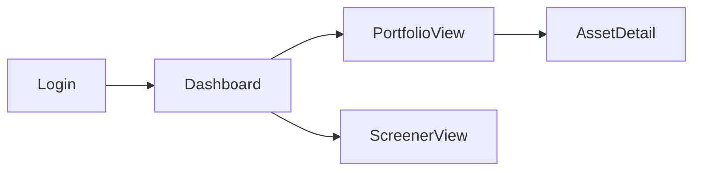

# The VECTOR
> A reusable, end-to-end method for designing and building any fullstack app.
> Python · React · PostgreSQL · Claude · Claude Code

---

## Core Principle

The human thinks visually. Everything else derives from what the human can see and touch.

**Design of outside → in. From uncertain to stable.**

---

## Roles

| Actor | Role |
|---|---|
| **You** | Think, draw, decide, validate, approve |
| **Claude.ai** | Ask, structure, generate, derive |
| **Claude Code** | Plan, build, audit |

> Never mix roles in the same session.

---

## The 13 Steps

```
HIGH HUMAN INVOLVEMENT
  Step 1  · Basic Idea Visualization          (BIV)
  Step 2  · Assisted Product Requirements     (APRW)
  Step 3  · AI Frontend Sketching Proposal    (AFSP)
  Step 4  · Frontend Skeleton De-codification (FSD)

AI DOES THE WORK · HUMAN REVIEWS
  Step 5  · API Contract Generation           (ACG)
  Step 6  · Data Model Generation             (DMG)
  Step 7  · Quant Model Dev Specifications    (QMDS)  [if applicable]
  Step 8  · Architecture Design Documentation (ADD)
  Step 9  · Context Document Generation       (CDG)
  Step 9.5· Design Freeze                     (DF)

CLAUDE CODE TAKES OVER
  Step 10 · Development Plan                  (DP)
  Step 11 · GitHub-ification                  (GHI)
  Step 12 · AI Development with Human-in-Loop (AIDH)
  Step 13 · Human Intensive Testing           (HIT)
```

---

## Step 1 — Basic Idea Visualization (BIV)

**Who:** You alone  
**Time:** 30–60 min  
**Tools:** Any drawing tool — Excalidraw, Figma, paper + camera, napkin + phone

Draw 4–6 sketches of how you imagine the app. These are not mockups. They are externalizations of what is in your head.

**Rules:**
- One sketch per main view
- No perfection required. Boxes, arrows, and labels are enough
- Add a short paragraph in natural language describing what the app does, who uses it, and what problem it solves

**Output:**
- 4–6 images (screenshots, photos, or exports)
- 1 short paragraph description

> Claude can process hand-drawn sketches. A phone photo of a paper drawing is valid input.

---

## Step 2 — Assisted Product Requirements Writing (APRW)

**Who:** You + Claude.ai  
**Time:** 30–60 min  
**Tools:** Claude.ai (new session)

Upload the sketches and the description. Claude reviews everything and asks a structured set of questions — no more, no less — to fully understand what you want to build.

### The fixed question set Claude must ask

Claude asks these questions in plain, non-technical language. Each question is designed so that someone with no technical background can answer it in 2–3 sentences. If a sketch or the description already answers one clearly, Claude skips it.

**What it does**
1. If you had to explain this app to a friend over coffee in one sentence, what would you say? *(Clarifies the core purpose without jargon)*
2. Who is going to use this? Paint me a quick picture of that person — what do they do, and why would they open this app? *(Identifies the primary user and their motivation)*
3. Will there be different types of users who see different things or can do different things? For example, an admin vs. a regular user. *(Detects multi-role requirements)*

**What matters most**
4. If you could only build three things for the first version, what would they be? *(Defines MVP scope)*
5. What are you deliberately leaving out for now — things that might be useful later but that you don't need on day one? *(Defines explicit out-of-scope)*

**How it works behind the scenes**
6. Does each user have their own private data, or does everyone see the same information? *(Determines data isolation requirements)*
7. Does the app do any kind of calculation, scoring, ranking, or automatic decision-making — or does it mostly just save and display information? *(Detects non-CRUD logic)*
8. Does this app need to talk to any outside service? For example, pull data from somewhere, send emails, or connect to a payment system. *(Identifies external integrations)*

**Look, feel, and limits**
9. Are there any hard rules about how this must work — for example, users must log in with Google, it must run in a specific country, or certain data can never leave a particular server? *(Surfaces non-negotiable constraints)*
10. Do you have a visual reference — a color palette, a font, another app whose look you like? If not, how would you describe the feeling you want: minimal, bold, corporate, playful? *(Captures aesthetic direction)*

After receiving answers, Claude writes the PRD.

**Output:** `docs/PRD.md`

### PRD structure
```
# Product Requirements Document

## Problem
## Primary user
## Core action
## User types and permissions
## In scope (v1)
## Out of scope (v1)
## Non-CRUD logic
## External integrations
## Technical constraints
## Aesthetic direction
## User stories
```

---

## Step 3 — AI Frontend Sketching Proposal (AFSP)

**Who:** Claude.ai (same session as Step 2)  
**Time:** 30–45 min  
**Tools:** Claude.ai → visual tool of choice for editing

Based on the PRD, Claude produces a complete frontend proposal. The human does not write anything here — only reviews and edits visually.

### What Claude generates

**A. View list**
Every view the frontend requires — no more, no less. For each view:
- Name
- Short description (1–2 sentences for mental visualization)
- Data it needs (inputs and outputs)
- A concise generation prompt (usable in any LLM)

**B. Visual artifact per view**
Claude runs each prompt and generates the view as an HTML + Tailwind artifact rendered inline. This is for visualization and communication only — not the final React code.

**C. Navigation flow diagram**
A Mermaid flowchart showing how views connect and in what order.



**Output:** `docs/views.md` + Mermaid diagram embedded

### Human action
Use your visual tool of choice to edit the views:
- **Figma** — recommended for aesthetic precision (colors, fonts, spacing, components)
- **Excalidraw** — recommended for speed (layout and flow changes)

Iterate until the views represent what you want to build at ~90% fidelity.

**Gate:** Human approves views and navigation flow before proceeding.

---

## Step 4 — Frontend Skeleton De-codification (FSD)

**Who:** Claude.ai  
**Time:** 1–2 hrs  
**Tools:** Claude.ai (same session)

Claude takes the approved views (images or exports from Step 3) and converts each one to React + Tailwind. All backend data is mocked. The output is a fully navigable frontend.

**Rules:**
- One component file per view
- Mock data lives in `/frontend/src/mocks/`
- No real API calls — all data is hardcoded in mocks
- Navigation must match the Mermaid diagram from Step 3

**Output:** A navigable React + Tailwind frontend with all views and mocked data.

### Human action
Run the frontend locally. Navigate through every view. Iterate with Claude until the visual result matches what you want to build. This is the last step where aesthetic decisions are made.

**Gate:** Human approves the frontend at ~90% visual fidelity before proceeding.

---

> From here, Claude does the heavy work. The human reviews and approves.

---

## Step 5 — API Contract Generation (ACG)

**Who:** Claude.ai  
**Time:** 30–45 min

Claude reads the React components and mock data from Step 4 and derives the full API contract.

**Output A:** `docs/api-spec.yaml` — complete OpenAPI 3.1 spec including:
- Every endpoint (method, path, description)
- Request schemas (body, query params, path params)
- Response schemas (success and error)
- HTTP error codes per endpoint

**Output B:** A human-readable summary in markdown — one table per endpoint group, written for understanding, not implementation.

**Gate:** Human reviews and approves. Iterate until correct.

---

## Step 6 — Data Model Generation (DMG)

**Who:** Claude.ai  
**Time:** 30–45 min

Claude derives the data model from the API contract.

**Output A:** `docs/data-model.md` — domain model in plain markdown (business entities and relationships, no column types yet)

**Output B:** `docs/erd.dbml` — physical schema in dbdiagram DSL including:
- All tables with column names and types
- Foreign keys and constraints
- Indexes for all query patterns

**Output C:** A plain-language explanation of the schema — written for understanding, not implementation.

**Gate:** Human reviews and approves. Iterate until correct.

---

## Step 7 — Quantitative Model Dev Specifications (QMDS)

**Who:** You + Claude.ai  
**Time:** Variable (30–90 min per model)  
**Skip if:** The app has no non-CRUD logic

For each quantitative model, Claude runs an assisted process to produce a Model Specification Document (MSD). The process has two paths depending on how well-defined the model is.

---

### Path A — Model is well-defined

The human already knows the logic, the inputs, and the expected output. Claude asks four questions and drafts the MSD directly.

**Claude asks:**
1. What does this model produce, and who or what uses that output? *(e.g. "a score between 0 and 1 for each asset, consumed by the portfolio construction module")*
2. What raw data does it need, and where does that data come from? *(e.g. "daily adjusted close prices from Yahoo Finance, going back 12 months")*
3. Walk me through the logic step by step, as if explaining to a smart person who is not a mathematician. *(The human describes the calculation in plain language — Claude will formalize it into math)*
4. Are there any academic papers, existing implementations, or prior work this is based on? *(Anchors parameter choices and methodology)*

Claude then produces the full MSD.

---

### Path B — Model is not well-defined

The human has a goal but is not sure how to achieve it. Claude runs a structured disambiguation process before writing the MSD.

**Stage 1 — Goal clarification**
Claude asks:
1. What decision or action should this model make easier or better? *(The human describes the business problem, not the solution)*
2. What information do you have available that could be relevant to that decision? *(Raw inputs — the human lists what data exists)*
3. What would a good output look like? How would you use it? *(Forces the human to describe the desired output concretely)*

**Stage 2 — Approach proposal**
Based on the answers, Claude proposes 2–3 concrete methodological approaches. For each it explains:
- What the model does in plain language
- What inputs it requires
- What the output looks like
- Pros and cons relative to the other options
- A complexity estimate (simple / moderate / complex)

The human selects one approach or asks Claude to combine elements.

**Stage 3 — Specification**
Claude asks the same four questions as Path A, now that the approach is clear, and produces the MSD.

---

### MSD structure

```
# MSD: <Model Name>

## Objective
## Universe and inputs
| Input | Source | Frequency | Point-in-time | Missing data rule |

## Mathematical specification
<LaTeX>

## Parameters
| Parameter | Value | Justification |

## Expected output
- Type, index, value range, null handling

## Known failure modes
- Conditions under which the model produces unreliable output
  (e.g. very small universe, all-identical inputs, extreme market regimes)

## Validation tests
- Mathematical properties to verify (range, monotonicity, distribution)
- Lookahead bias check
- Benchmark: does it produce sensible rankings on historical data?
```

> Note: edge cases are not asked upfront. They emerge from the mathematical specification and are documented by Claude as *known failure modes* based on the model's structure — not from the human's intuition at design time.

**Output:** `docs/research/msd_<model>.md` + `research/<model>.ipynb` skeleton

**Gate:** Human reviews and approves each MSD before proceeding.

---

## Step 8 — Architecture Design Documentation (ADD)

**Who:** Claude.ai  
**Time:** 30–45 min

Claude designs the full system architecture from all prior documents.

**Output A:** C4 diagram in Mermaid (Context + Container levels)

**Output B:** `docs/architecture.md` including:
- Layer diagram: Router → Service → Repository → Models (+ Quant layer if applicable)
- Folder structure for backend and frontend
- Key ADRs (one per non-obvious decision)

**Output C:** Patterns document:
- Mandatory patterns (e.g. "all DB access goes through the repository layer")
- Forbidden patterns (e.g. "no business logic in routers")

### ADR format
```
# ADR-00N: <Title>
Status: Accepted
Date: YYYY-MM-DD

## Context
## Decision
## Alternatives considered
## Consequences
```

**Gate:** Human reviews and approves. Iterate until correct.

---

## Step 9 — Context Document Generation (CDG)

**Who:** Claude.ai  
**Time:** 20–30 min

Claude synthesizes all prior documents into a single instruction file for Claude Code.

**Output:** `CLAUDE.md` (repo root)

### CLAUDE.md must include
- App description (2–3 sentences)
- Stack with exact versions (Python, FastAPI, React, Tailwind, PostgreSQL, etc.)
- Folder structure (copy from Step 8)
- Naming conventions (files, functions, variables, DB tables)
- Code style and aesthetic preferences
- Mandatory and forbidden patterns (copy from Step 8)
- How to run the app locally
- How to run migrations
- How to run tests

**Gate:** Human reviews and approves.

---

## Step 9.5 — Design Freeze (DF)

**Who:** You  
**Time:** 5 min

Before touching Claude Code, you formally declare the design closed.

**Checklist:**
- [ ] PRD approved
- [ ] All views approved at ~90% fidelity
- [ ] API contract approved
- [ ] ERD approved
- [ ] All MSDs approved (if applicable)
- [ ] Architecture approved
- [ ] CLAUDE.md approved

**Rule:** No scope changes after this point without returning to the relevant step, regenerating the affected documents, and updating CLAUDE.md. The code and the design must always be in sync.

---

## Step 10 — Development Plan (DP)

**Who:** Claude Code  
**Time:** 30–60 min

Place all docs in `/docs` and `CLAUDE.md` in the repo root. Open Claude Code and ask it to produce a detailed development plan.

The plan must:
- Be task-by-task, not phase-by-phase
- Follow dependency order: DB → Backend → Quant layer → Frontend → Integration
- Have explicit phases (MVP, V1, V2) so a working version always exists
- Each phase must be independently deployable

**Output:** `docs/DEVELOPMENT_PLAN.md`

**Gate:** Human reviews and iterates until the plan is correct and complete.

---

## Step 11 — GitHub-ification (GHI)

**Who:** Claude Code  
**Time:** 30–45 min

Claude Code creates all GitHub issues from the development plan and sets up GitHub Projects for tracking.

**Structure:**
- One issue per task
- Issues labeled by phase (MVP, V1, V2) and type (feat, fix, chore, docs)
- Milestone per phase
- GitHub Project board with columns: Backlog · In Progress · In Review · Done

**Gate:** Human reviews the issue list and approves before any coding begins.

---

## Step 12 — AI Development with Human-in-the-Loop (AIDH)

**Who:** Claude Code (two sessions) + You  
**Tools:** Claude Code · GitHub · GitHub Projects

This is the core development loop. One issue at a time.

### Per-issue cycle

```
Human assigns issue to Claude Code (Coder session)
      ↓
Coder implements the issue and opens a PR
      ↓
Claude Code (Reviewer session) reviews the PR
  · Checks against CLAUDE.md patterns
  · Checks against the relevant spec (API contract, ERD, MSD)
  · Requests changes or approves
      ↓
Human reviews the PR
  · Visual check if frontend
  · Logic check if backend or quant
  · Requests changes or approves
      ↓
Human merges to DEV branch
      ↓
Next issue
```

### Coder session system prompt
```
You are a senior engineer implementing a specific GitHub issue.
Read CLAUDE.md before writing any code.
Follow all mandatory patterns. Never violate forbidden patterns.
Open a PR when done. Do not touch files outside the scope of this issue.
```

### Reviewer session system prompt
```
You are a senior engineer reviewing a PR.
Check the implementation against CLAUDE.md, the API contract, the ERD,
and the relevant MSD if applicable.
Be specific. Request changes with exact line references.
Approve only when all patterns are respected and the spec is met.
```

### Audit cadence
Every 10 PRs or at the end of each phase, Claude Code audits the full codebase:
- Does the folder structure match `CLAUDE.md`?
- Are all mandatory patterns respected?
- Are there any forbidden patterns present?
- Does the implemented API match `api-spec.yaml`?
- Does the DB schema match `erd.dbml`?

**Output of audit:** `docs/audit_<phase>_<date>.md`

---

## Step 13 — Human Intensive Testing (HIT)

**Who:** You  
**Trigger:** End of each phase (MVP, V1, V2, etc.)

At the end of each phase, ask Claude Code to spin up the full system in Docker.

### Testing loop

```
Claude Code starts Docker (full stack: DB + backend + frontend)
      ↓
Human navigates the app manually
  · Every view
  · Every user action
  · Every edge case you can think of
      ↓
Human logs every issue found (title + steps to reproduce + expected vs actual)
      ↓
Human passes issue list to Claude Code
      ↓
Claude Code fixes all issues
      ↓
Claude Code restarts Docker
      ↓
Human tests again
      ↓
Repeat until the phase is accepted
```

**Gate:** Human formally accepts the phase before moving to the next one.

---

## Repository Structure

```
/ (root)
├── CLAUDE.md
├── docs/
│   ├── PRD.md
│   ├── views.md
│   ├── api-spec.yaml
│   ├── data-model.md
│   ├── erd.dbml
│   ├── architecture.md
│   ├── DEVELOPMENT_PLAN.md
│   ├── adrs/
│   │   └── 00N-<title>.md
│   ├── research/
│   │   ├── msd_<model>.md
│   │   └── <model>.ipynb
│   └── audits/
│       └── audit_<phase>_<date>.md
├── backend/
│   ├── api/
│   ├── services/
│   ├── repositories/
│   ├── models/
│   ├── schemas/
│   ├── quant/
│   └── core/
└── frontend/
    └── src/
        ├── views/
        ├── components/
        └── mocks/
```

---

## The Method in One Line

> Draw it → derive it → freeze it → build it → test it.
